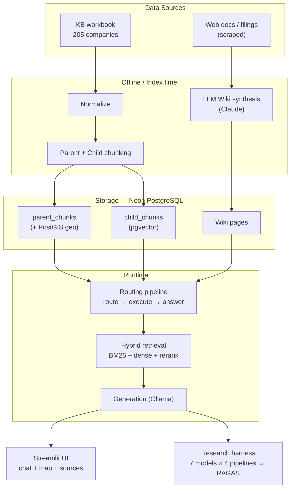
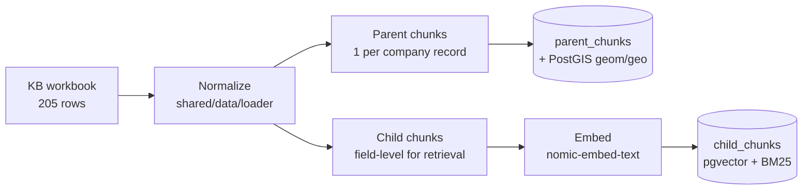
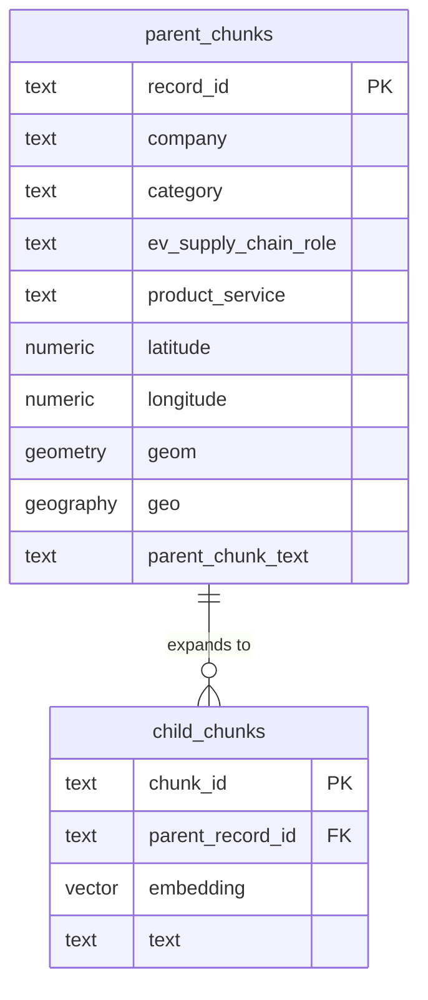
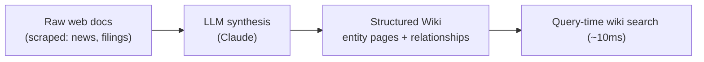
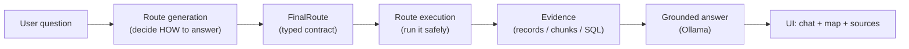
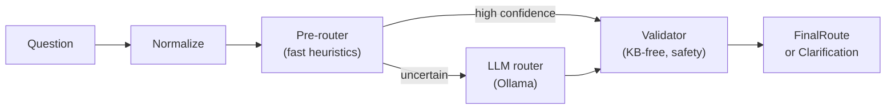
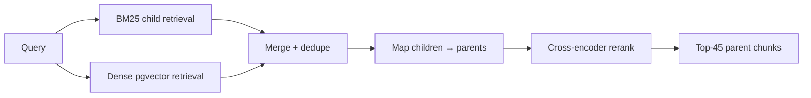
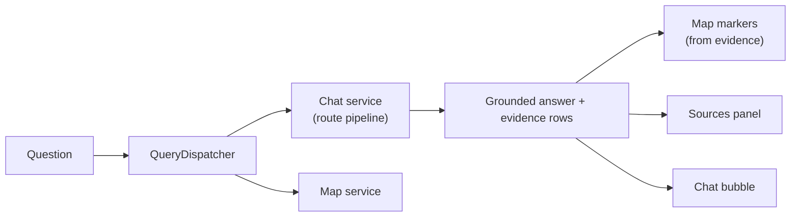
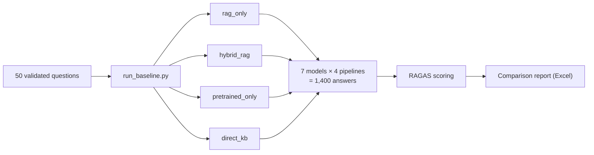

# GNEM Retrieval-RAG — Presentation Deck (content + diagrams)

This file is the **single source** for generating a slide deck about the codebase.
It contains, per slide: a title, the on-slide text (bullets), speaker notes, and —
where useful — a **Mermaid diagram** that doubles as the slide's image/visual.

How to use it is at the very bottom (**"How to turn this into a PPT with Claude"**).

> Audience: technical reviewers / stakeholders. Suggested length: ~20 slides, 25–30 min.

---

## Slide 1 — Title

**GNEM Retrieval-RAG**
*Georgia EV Supply-Chain Intelligence — a routed RAG + spatial Q&A system*

- Knowledge base of **205 Georgia EV supply-chain companies**
- Natural-language questions → grounded answers, on a map, with sources
- Built on PostgreSQL (pgvector + PostGIS), local LLMs (Ollama), and Claude

*Speaker notes:* One system, two faces — an interactive chat/map app for end users,
and a research harness that benchmarks 7 LLMs across 4 answer strategies.

---

## Slide 2 — The Problem

- Georgia is a fast-growing EV manufacturing hub (Hyundai, Kia, SK, etc.)
- Supply-chain knowledge is scattered across spreadsheets, web pages, filings
- Analysts ask **mixed questions**: "list Tier-1/2 battery suppliers", "what's
  near Kia Georgia?", "who could replace supplier X?"
- These need **different engines**: structured filters, spatial search, semantic
  retrieval, document evidence — not one-size-fits-all RAG

*Speaker notes:* The core insight driving the design: a single retrieval method
can't answer all of these well. The system **routes** each question to the right one.

---

## Slide 3 — What It Does (at a glance)

- Answers Georgia EV supply-chain questions in natural language
- **Grounded** — every answer is backed by KB records or document evidence
- **Spatial** — companies plotted on an interactive map (folium/Leaflet)
- **Transparent** — shows the exact records and the SQL used ("sources")
- **Benchmarked** — research mode scores answer quality with RAGAS metrics

*Speaker notes:* Grounded + transparent are the differentiators vs a plain chatbot.

---

## Slide 4 — High-Level Architecture



*Speaker notes:* Left = data in. Middle = stored in one Postgres DB. Right = two
consumers of the same data: the live UI and the offline evaluation harness.

---

## Slide 5 — Technology Stack

| Layer | Technology | Why |
|---|---|---|
| Storage | **Neon PostgreSQL** | single managed DB for everything |
| Vectors | **pgvector** | dense semantic search in-DB |
| Lexical | **rank-bm25** | keyword/BM25 child retrieval |
| Spatial | **PostGIS** (`geom`/`geo`) | radius, distance, county containment |
| Reranking | **cross-encoder** (ms-marco-MiniLM-L12) | precision on top candidates |
| Embeddings | **nomic-embed-text-v1.5** | document/query embeddings |
| Generation | **Ollama** (qwen2.5, llama3.1, gemma3, mistral) | local, private LLMs |
| Wiki synthesis | **Claude / Anthropic API** | structured knowledge extraction |
| UI | **Streamlit + folium + streamlit-folium** | chat + Leaflet map |
| Validation | **Pydantic** | typed route contracts |
| Eval | **RAGAS** (Ollama-scored) | answer quality metrics |

*Speaker notes:* Everything self-hostable except Claude (used offline for wiki).
The DB is the integration point — pgvector + PostGIS in the same Postgres.

---

## Slide 6 — The Knowledge Base

- **205 companies**, 16 normalized columns each
- Key fields: `company`, `category` (Tier 1/2, OEM…), `ev_supply_chain_role`,
  `product_service`, `updated_location`, `latitude`/`longitude`, `primary_oems`,
  `employment`, `ev_battery_relevant`
- Source: `kb/GNEM - Auto Landscape Lat Long Updated.xlsx`
- **50 human-validated Q&A pairs** used as the evaluation golden set

*Speaker notes:* The 16-column schema is the backbone — it defines what can be
filtered, displayed, and cited. Geo columns enable the map and spatial routes.

---

## Slide 7 — Offline Pipeline (build once)



- `index_pgvector.py` builds parent + child chunks and indexes them
- Parent chunk = full record (the unit of evidence and citation)
- Child chunks = smaller, embedded units for precise retrieval
- Geocodes each company into PostGIS geometry/geography columns

*Speaker notes:* Parent/child chunking: retrieve on small child chunks for
precision, but return the whole parent record for grounding.

---

## Slide 8 — Data Model



- One Postgres DB holds **structured fields + vectors + spatial geometry**
- `geom` (geometry) + `geo` (geography), both SRID 4326, kept in sync with lat/lon
- Child → parent mapping powers "retrieve small, return full record"

*Speaker notes:* This single-table-with-geo design is what lets one query mix
filtering (SQL), semantics (pgvector), and distance (PostGIS).

---

## Slide 9 — Web Knowledge & LLM Wiki



- `kb_builder` scrapes/collects documents (trafilatura, pdfplumber, OCR…)
- **Claude** synthesizes them into a persistent wiki of entity pages
- Fast wiki lookup augments retrieval at query time

*Speaker notes:* This is the unstructured complement to the structured KB —
captures facts that aren't in the spreadsheet.

---

## Slide 10 — Two Ways to Answer

| | Interactive Routing Pipeline | Research / Eval Pipeline |
|---|---|---|
| Purpose | Live Q&A in the app | Benchmark answer quality |
| Entry | `RouteService` → `execute_route` | `run_baseline.py` |
| Strategy | **route to the right engine** | 4 fixed pipelines × 7 models |
| Output | answer + map + sources | 1,400 answers → RAGAS report |

*Speaker notes:* Same KB, two consumers. Next slides drill into the interactive
routing pipeline (the app), then the research harness.

---

## Slide 11 — Interactive Pipeline Overview



- **Separation of concerns:** generation *decides*, execution *runs* — never both
- The `FinalRoute` is a validated contract passed between them
- Every answer carries its evidence forward to the UI

*Speaker notes:* This decision/execution split is the architectural spine of the
app — it makes the system safe, testable, and auditable.

---

## Slide 12 — Route Generation



- **Pre-router**: cheap heuristics resolve obvious cases instantly
- **LLM router**: handles ambiguous questions
- **Validator**: corrects route, resolves filters, enforces safety — **never reads
  KB data values** (preserves every value verbatim)
- Asks a **clarifying question** only when info is genuinely missing

*Speaker notes:* The validator is deliberately KB-free: it validates *structure and
executability*, not facts — keeps routing honest and injection-safe.

---

## Slide 13 — The Route Types

| Route | Answers… | Engine |
|---|---|---|
| `structured_sql` | lists, counts, filters, rankings, groups | safe parameterized SQL |
| `geo_search` | "near / within / closest / in county" | **PostGIS** |
| `exact_lookup` | one named company | SQL by name |
| `keyword_search` | keyword over documents | BM25 |
| `vector_search` | semantic / fuzzy intent | pgvector |
| `hybrid_search` | structured + document evidence | SQL + chunks |
| `disruption_analysis` | risk / alternatives | dependency graph |
| `clarification_needed` | ambiguous question | ask the user |

*Speaker notes:* One router, many engines. The map/spatial questions go to PostGIS;
the analytical ones to SQL; the fuzzy ones to vector/keyword/hybrid.

---

## Slide 14 — Route Execution (safety first)

- Each route has a dedicated **executor**; `execute_route` dispatches by type
- **LLM never writes SQL.** Every column is allowlist-checked; every value is a
  bound parameter (no injection surface)
- Executors return **evidence** (rows / chunks / SQL) + a deterministic answer
- Coordinates are always fetched so results can be mapped

*Speaker notes:* The allowlist + parameterized values mean even a mis-routed
question can't produce unsafe SQL. Evidence is the contract to the UI.

---

## Slide 15 — Hybrid Retrieval (for document/semantic routes)



- Parallel **lexical (BM25)** + **dense (pgvector)** retrieval
- Merge → map child chunks to parent records → **cross-encoder rerank**
- Returns the most relevant full records as grounding context

*Speaker notes:* Lexical catches exact terms, dense catches meaning; reranking
gives precision at the top. This powers vector/keyword/hybrid routes and the eval.

---

## Slide 16 — Answer Generation

- Local **Ollama** model grounds the answer in retrieved evidence only
- Prompt rule: *use ONLY the evidence; never invent facts; include all rows*
- Map-only fields (lat/lon) are **stripped before grounding** so the model
  doesn't emit raw coordinates
- Falls back to a deterministic template if the LLM is unavailable

*Speaker notes:* The LLM never sees the database or writes SQL — it only
re-phrases already-retrieved evidence into natural language.

---

## Slide 17 — The Application (UI)



- **Streamlit** app: chat on the left, **interactive map** on the right
- Map markers come **straight from the answer's evidence** — text and map agree
- Co-located companies share one pin (popup lists all of them)

*Speaker notes:* Earlier the map and chat used separate pipelines and diverged;
now both are driven by the same evidence rows. ➜ add a screenshot here.

> **IMAGE SLIDE:** insert a screenshot of the running app (chat + map).

---

## Slide 18 — Transparency: Sources & Provenance

- "Sources" = the **records** the answer used (one card per company)
- The executed **SQL** is shown separately as *method*, not as a source
- Aggregates show their group rows + the query behind the number
- Distinction: **evidence (what)** vs **method (how)**

*Speaker notes:* This is the RAG "show your sources" idea extended to SQL answers:
the rows are the sources; the query is the retrieval method.

> **IMAGE SLIDE:** screenshot of the Sources panel + the "Query" expander.

---

## Slide 19 — Spatial / Map Features

- PostGIS powers radius, distance, nearest, and county-containment queries
- Map renders every answer company with valid coordinates
- **Data-quality aware:** bad coordinates (e.g. a point in India) and
  co-located sites are handled explicitly (grouped pins + count)

*Speaker notes:* Good example of code + data working together — fixed a corrupt
coordinate in Postgres and grouped overlapping markers so all companies show.

> **IMAGE SLIDE:** screenshot of the map with a multi-company popup open.

---

## Slide 20 — Research Harness & Evaluation



- **4 answer strategies** compared: retrieval-strict, hybrid, no-context, full-KB
- **RAGAS metrics:** accuracy, faithfulness, groundedness, answer-relevancy
- Produces a reproducible model/pipeline comparison

*Speaker notes:* This is how we justify design choices with numbers, not vibes.

---

## Slide 21 — Quality & Safety

- **Typed contracts** (Pydantic) between routing and execution
- **SQL safety:** column allowlist + fully parameterized values
- **KB-free validator:** preserves user values verbatim, no silent rewriting
- **Tested:** pytest suites for routing, execution, retrieval, and UI services

*Speaker notes:* The safety properties are what make a routed-LLM system
trustworthy in front of real users.

---

## Slide 22 — Summary

- One KB, one Postgres (vectors + spatial), many answer engines
- **Route → execute → ground**: pick the right tool per question, safely
- Answers are **grounded, mapped, and sourced** — not just generated
- A research harness keeps quality measurable

*Speaker notes:* The thesis in one line — *the right retrieval per question,
with the evidence always attached.*

---
---

# How to turn this into a PPT with Claude

**Step 1 — Capture the image slides.** Run the app and screenshot the three
"IMAGE SLIDE" moments above (chat+map, sources panel, map popup). Save them so you
can drop them into the generated deck.

```bash
python run_streamlit_ui.py    # or: streamlit run georgia_ev_intelligence/streamlit_ui/app.py
```

**Step 2 — Generate the deck.** Open **claude.ai**, attach/paste this whole file,
and use a prompt like:

> "Using the slide content in this file, create a presentation. The Mermaid blocks
> are the diagrams for those slides — render them as clean visuals. Produce a
> self-contained **HTML slide deck** (one `<section>` per slide, 16:9, dark
> professional theme, large headings, the diagrams rendered with Mermaid.js).
> Keep the on-slide text as concise bullets and put the 'Speaker notes' into
> presenter notes. Leave labeled placeholders for the IMAGE SLIDE screenshots."

**Step 3 — Pick your output format** (tell Claude which):
- **HTML deck** (reveal.js style) — easiest to preview, exportable to PDF/PPT.
- **`python-pptx` script** — generates a native `.pptx`; you run it to get the file.
- **Google Slides outline** — if you'd rather assemble manually.

**Step 4 — Insert screenshots** into the three image placeholders and adjust theme.

*Tip:* Mermaid diagrams in this file are already valid — Claude can render them
directly, and most Markdown/HTML deck tools (and the Mermaid Live Editor) export
them as PNG/SVG if you want static images instead.
```
